# Uptime Status
Last updated: Sat Sep 14 11:17:52 UTC 2024

✅ https://nptel.ac.in is up (Response time: .133561656s)
✅ https://archive.nptel.ac.in is up (Response time: 1.390047285s)
✅ https://dashboard.dev.nptel.ac.in/InternalCandidateDashboard/ is up (Response time: .778446805s)
✅ https://eex.dev.iitm.ac.in is up (Response time: 1.315878890s)
✅ https://jup.dev.iitm.ac.in is up (Response time: 1.054267982s)

## Summary Statistics (Last 24 hours)
```
Website                                                        Availability  Avg Response Time
https://eex.dev.iitm.ac.in                                     100.00%       1.295s
https://jup.dev.iitm.ac.in                                     100.00%       1.204s
https://dashboard.dev.nptel.ac.in/InternalCandidateDashboard/  100.00%       0.818s
https://archive.nptel.ac.in                                    98.55%        3.381s
https://nptel.ac.in                                            100.00%       0.256s
```

## Uptime Graph (Last 24 hours)

```mermaid
gantt
    title Uptime Timeline
    dateFormat YYYY-MM-DD HH:mm:ss
    axisFormat %H:%M
    section https://nptel.ac.in
        Up: active, 2024-09-13 17:02:35, 5m
        Up: active, 2024-09-13 17:19:13, 5m
        Up: active, 2024-09-13 17:32:28, 5m
        Up: active, 2024-09-13 17:43:43, 5m
        Up: active, 2024-09-13 17:55:11, 5m
        Up: active, 2024-09-13 18:24:46, 5m
        Up: active, 2024-09-13 18:42:34, 5m
        Up: active, 2024-09-13 18:53:45, 5m
        Up: active, 2024-09-13 19:12:36, 5m
        Up: active, 2024-09-13 19:25:02, 5m
        Up: active, 2024-09-13 19:37:36, 5m
        Up: active, 2024-09-13 19:48:39, 5m
        Up: active, 2024-09-13 19:59:59, 5m
        Up: active, 2024-09-13 20:24:18, 5m
        Up: active, 2024-09-13 20:37:45, 5m
        Up: active, 2024-09-13 20:49:08, 5m
        Up: active, 2024-09-13 21:00:38, 5m
        Up: active, 2024-09-13 21:22:18, 5m
        Up: active, 2024-09-13 21:34:40, 5m
        Up: active, 2024-09-13 21:46:12, 5m
        Up: active, 2024-09-13 21:57:46, 5m
        Up: active, 2024-09-13 22:22:38, 5m
        Up: active, 2024-09-13 22:37:34, 5m
        Up: active, 2024-09-13 22:49:07, 5m
        Up: active, 2024-09-13 23:00:45, 5m
        Up: active, 2024-09-13 23:24:24, 5m
        Up: active, 2024-09-13 23:37:59, 5m
        Up: active, 2024-09-13 23:49:15, 5m
        Up: active, 2024-09-14 00:32:13, 5m
        Up: active, 2024-09-14 01:56:06, 5m
        Up: active, 2024-09-14 02:40:10, 5m
        Up: active, 2024-09-14 02:42:41, 5m
        Up: active, 2024-09-14 02:44:20, 5m
        Up: active, 2024-09-14 02:46:46, 5m
        Up: active, 2024-09-14 02:56:11, 5m
        Up: active, 2024-09-14 02:59:38, 5m
        Up: active, 2024-09-14 03:00:29, 5m
        Up: active, 2024-09-14 03:01:25, 5m
        Up: active, 2024-09-14 03:26:07, 5m
        Up: active, 2024-09-14 03:39:53, 5m
        Up: active, 2024-09-14 03:51:12, 5m
        Up: active, 2024-09-14 04:12:40, 5m
        Up: active, 2024-09-14 04:32:58, 5m
        Up: active, 2024-09-14 04:44:41, 5m
        Up: active, 2024-09-14 04:56:05, 5m
        Up: active, 2024-09-14 05:19:26, 5m
        Up: active, 2024-09-14 05:35:08, 5m
        Up: active, 2024-09-14 05:46:43, 5m
        Up: active, 2024-09-14 05:57:55, 5m
        Up: active, 2024-09-14 06:30:31, 5m
        Up: active, 2024-09-14 06:45:11, 5m
        Up: active, 2024-09-14 06:56:45, 5m
        Up: active, 2024-09-14 07:19:02, 5m
        Up: active, 2024-09-14 07:30:24, 5m
        Up: active, 2024-09-14 07:41:50, 5m
        Up: active, 2024-09-14 07:53:10, 5m
        Up: active, 2024-09-14 08:18:39, 5m
        Up: active, 2024-09-14 08:37:18, 5m
        Up: active, 2024-09-14 08:48:41, 5m
        Up: active, 2024-09-14 09:00:12, 5m
        Up: active, 2024-09-14 09:23:09, 5m
        Up: active, 2024-09-14 09:34:52, 5m
        Up: active, 2024-09-14 09:46:18, 5m
        Up: active, 2024-09-14 09:57:26, 5m
        Up: active, 2024-09-14 10:22:06, 5m
        Up: active, 2024-09-14 10:36:54, 5m
        Up: active, 2024-09-14 10:48:32, 5m
        Up: active, 2024-09-14 10:59:57, 5m
        Up: active, 2024-09-14 11:17:52, 5m
    section https://archive.nptel.ac.in
        Up: active, 2024-09-13 17:02:37, 5m
        Up: active, 2024-09-13 17:19:15, 5m
        Up: active, 2024-09-13 17:32:29, 5m
        Up: active, 2024-09-13 17:43:45, 5m
        Up: active, 2024-09-13 17:55:13, 5m
        Up: active, 2024-09-13 18:24:47, 5m
        Up: active, 2024-09-13 18:42:35, 5m
        Up: active, 2024-09-13 18:53:46, 5m
        Up: active, 2024-09-13 19:12:37, 5m
        Up: active, 2024-09-13 19:25:03, 5m
        Up: active, 2024-09-13 19:37:38, 5m
        Up: active, 2024-09-13 19:48:40, 5m
        Up: active, 2024-09-13 20:00:00, 5m
        Up: active, 2024-09-13 20:24:19, 5m
        Up: active, 2024-09-13 20:37:46, 5m
        Up: active, 2024-09-13 20:49:09, 5m
        Up: active, 2024-09-13 21:00:39, 5m
        Up: active, 2024-09-13 21:22:19, 5m
        Up: active, 2024-09-13 21:34:41, 5m
        Up: active, 2024-09-13 21:46:13, 5m
        Up: active, 2024-09-13 21:57:47, 5m
        Up: active, 2024-09-13 22:22:40, 5m
        Up: active, 2024-09-13 22:37:35, 5m
        Up: active, 2024-09-13 22:49:08, 5m
        Up: active, 2024-09-13 23:00:46, 5m
        Up: active, 2024-09-13 23:24:25, 5m
        Up: active, 2024-09-13 23:38:01, 5m
        Up: active, 2024-09-13 23:49:16, 5m
        Up: active, 2024-09-14 00:32:15, 5m
        Up: active, 2024-09-14 01:56:07, 5m
        Up: active, 2024-09-14 02:40:12, 5m
        Up: active, 2024-09-14 02:42:43, 5m
        Up: active, 2024-09-14 02:44:21, 5m
        Up: active, 2024-09-14 02:46:47, 5m
        Up: active, 2024-09-14 02:56:12, 5m
        Up: active, 2024-09-14 02:59:39, 5m
        Up: active, 2024-09-14 03:00:30, 5m
        Up: active, 2024-09-14 03:01:26, 5m
        Up: active, 2024-09-14 03:26:08, 5m
        Up: active, 2024-09-14 03:40:04, 5m
        Up: active, 2024-09-14 03:51:13, 5m
        Up: active, 2024-09-14 04:12:41, 5m
        Up: active, 2024-09-14 04:33:00, 5m
        Up: active, 2024-09-14 04:44:42, 5m
        Up: active, 2024-09-14 04:56:07, 5m
        Up: active, 2024-09-14 05:19:27, 5m
        Up: active, 2024-09-14 05:35:10, 5m
        Up: active, 2024-09-14 05:46:45, 5m
        Up: active, 2024-09-14 05:57:57, 5m
        Up: active, 2024-09-14 06:30:32, 5m
        Down: crit, 2024-09-14 06:47:26, 5m
        Up: active, 2024-09-14 06:56:47, 5m
        Up: active, 2024-09-14 07:19:03, 5m
        Up: active, 2024-09-14 07:30:25, 5m
        Up: active, 2024-09-14 07:41:51, 5m
        Up: active, 2024-09-14 07:53:12, 5m
        Up: active, 2024-09-14 08:18:40, 5m
        Up: active, 2024-09-14 08:37:19, 5m
        Up: active, 2024-09-14 08:48:42, 5m
        Up: active, 2024-09-14 09:00:13, 5m
        Up: active, 2024-09-14 09:23:10, 5m
        Up: active, 2024-09-14 09:34:54, 5m
        Up: active, 2024-09-14 09:46:19, 5m
        Up: active, 2024-09-14 09:57:28, 5m
        Up: active, 2024-09-14 10:22:07, 5m
        Up: active, 2024-09-14 10:36:55, 5m
        Up: active, 2024-09-14 10:48:33, 5m
        Up: active, 2024-09-14 10:59:58, 5m
        Up: active, 2024-09-14 11:17:53, 5m
    section https://dashboard.dev.nptel.ac.in/InternalCandidateDashboard/
        Up: active, 2024-09-13 17:02:38, 5m
        Up: active, 2024-09-13 17:19:15, 5m
        Up: active, 2024-09-13 17:32:30, 5m
        Up: active, 2024-09-13 17:43:46, 5m
        Up: active, 2024-09-13 17:55:13, 5m
        Up: active, 2024-09-13 18:24:48, 5m
        Up: active, 2024-09-13 18:42:36, 5m
        Up: active, 2024-09-13 18:53:47, 5m
        Up: active, 2024-09-13 19:12:38, 5m
        Up: active, 2024-09-13 19:25:04, 5m
        Up: active, 2024-09-13 19:37:38, 5m
        Up: active, 2024-09-13 19:48:41, 5m
        Up: active, 2024-09-13 20:00:01, 5m
        Up: active, 2024-09-13 20:24:20, 5m
        Up: active, 2024-09-13 20:37:47, 5m
        Up: active, 2024-09-13 20:49:10, 5m
        Up: active, 2024-09-13 21:00:40, 5m
        Up: active, 2024-09-13 21:22:20, 5m
        Up: active, 2024-09-13 21:34:42, 5m
        Up: active, 2024-09-13 21:46:14, 5m
        Up: active, 2024-09-13 21:57:48, 5m
        Up: active, 2024-09-13 22:22:41, 5m
        Up: active, 2024-09-13 22:37:36, 5m
        Up: active, 2024-09-13 22:49:09, 5m
        Up: active, 2024-09-13 23:00:47, 5m
        Up: active, 2024-09-13 23:24:26, 5m
        Up: active, 2024-09-13 23:38:01, 5m
        Up: active, 2024-09-13 23:49:17, 5m
        Up: active, 2024-09-14 00:32:16, 5m
        Up: active, 2024-09-14 01:56:08, 5m
        Up: active, 2024-09-14 02:40:13, 5m
        Up: active, 2024-09-14 02:42:43, 5m
        Up: active, 2024-09-14 02:44:22, 5m
        Up: active, 2024-09-14 02:46:48, 5m
        Up: active, 2024-09-14 02:56:13, 5m
        Up: active, 2024-09-14 02:59:40, 5m
        Up: active, 2024-09-14 03:00:31, 5m
        Up: active, 2024-09-14 03:01:27, 5m
        Up: active, 2024-09-14 03:26:09, 5m
        Up: active, 2024-09-14 03:40:05, 5m
        Up: active, 2024-09-14 03:51:14, 5m
        Up: active, 2024-09-14 04:12:42, 5m
        Up: active, 2024-09-14 04:33:00, 5m
        Up: active, 2024-09-14 04:44:43, 5m
        Up: active, 2024-09-14 04:56:07, 5m
        Up: active, 2024-09-14 05:19:28, 5m
        Up: active, 2024-09-14 05:35:10, 5m
        Up: active, 2024-09-14 05:46:46, 5m
        Up: active, 2024-09-14 05:57:57, 5m
        Up: active, 2024-09-14 06:30:33, 5m
        Up: active, 2024-09-14 06:47:27, 5m
        Up: active, 2024-09-14 06:56:47, 5m
        Up: active, 2024-09-14 07:19:04, 5m
        Up: active, 2024-09-14 07:30:26, 5m
        Up: active, 2024-09-14 07:41:52, 5m
        Up: active, 2024-09-14 07:53:12, 5m
        Up: active, 2024-09-14 08:18:41, 5m
        Up: active, 2024-09-14 08:37:20, 5m
        Up: active, 2024-09-14 08:48:43, 5m
        Up: active, 2024-09-14 09:00:14, 5m
        Up: active, 2024-09-14 09:23:11, 5m
        Up: active, 2024-09-14 09:34:55, 5m
        Up: active, 2024-09-14 09:46:20, 5m
        Up: active, 2024-09-14 09:57:28, 5m
        Up: active, 2024-09-14 10:22:08, 5m
        Up: active, 2024-09-14 10:36:56, 5m
        Up: active, 2024-09-14 10:48:34, 5m
        Up: active, 2024-09-14 10:59:59, 5m
        Up: active, 2024-09-14 11:17:54, 5m
    section https://eex.dev.iitm.ac.in
        Up: active, 2024-09-13 17:02:39, 5m
        Up: active, 2024-09-13 17:19:16, 5m
        Up: active, 2024-09-13 17:32:31, 5m
        Up: active, 2024-09-13 17:43:47, 5m
        Up: active, 2024-09-13 17:55:15, 5m
        Up: active, 2024-09-13 18:24:50, 5m
        Up: active, 2024-09-13 18:42:37, 5m
        Up: active, 2024-09-13 18:53:48, 5m
        Up: active, 2024-09-13 19:12:39, 5m
        Up: active, 2024-09-13 19:25:05, 5m
        Up: active, 2024-09-13 19:37:40, 5m
        Up: active, 2024-09-13 19:48:42, 5m
        Up: active, 2024-09-13 20:00:02, 5m
        Up: active, 2024-09-13 20:24:21, 5m
        Up: active, 2024-09-13 20:37:48, 5m
        Up: active, 2024-09-13 20:49:11, 5m
        Up: active, 2024-09-13 21:00:42, 5m
        Up: active, 2024-09-13 21:22:21, 5m
        Up: active, 2024-09-13 21:34:43, 5m
        Up: active, 2024-09-13 21:46:16, 5m
        Up: active, 2024-09-13 21:57:49, 5m
        Up: active, 2024-09-13 22:22:42, 5m
        Up: active, 2024-09-13 22:37:37, 5m
        Up: active, 2024-09-13 22:49:10, 5m
        Up: active, 2024-09-13 23:00:48, 5m
        Up: active, 2024-09-13 23:24:27, 5m
        Up: active, 2024-09-13 23:38:03, 5m
        Up: active, 2024-09-13 23:49:18, 5m
        Up: active, 2024-09-14 00:32:17, 5m
        Up: active, 2024-09-14 01:56:09, 5m
        Up: active, 2024-09-14 02:40:14, 5m
        Up: active, 2024-09-14 02:42:45, 5m
        Up: active, 2024-09-14 02:44:23, 5m
        Up: active, 2024-09-14 02:46:49, 5m
        Up: active, 2024-09-14 02:56:15, 5m
        Up: active, 2024-09-14 02:59:41, 5m
        Up: active, 2024-09-14 03:00:32, 5m
        Up: active, 2024-09-14 03:01:28, 5m
        Up: active, 2024-09-14 03:26:10, 5m
        Up: active, 2024-09-14 03:40:06, 5m
        Up: active, 2024-09-14 03:51:15, 5m
        Up: active, 2024-09-14 04:12:44, 5m
        Up: active, 2024-09-14 04:33:01, 5m
        Up: active, 2024-09-14 04:44:44, 5m
        Up: active, 2024-09-14 04:56:09, 5m
        Up: active, 2024-09-14 05:19:29, 5m
        Up: active, 2024-09-14 05:35:12, 5m
        Up: active, 2024-09-14 05:46:47, 5m
        Up: active, 2024-09-14 05:57:59, 5m
        Up: active, 2024-09-14 06:30:35, 5m
        Up: active, 2024-09-14 06:47:28, 5m
        Up: active, 2024-09-14 06:56:48, 5m
        Up: active, 2024-09-14 07:19:05, 5m
        Up: active, 2024-09-14 07:30:27, 5m
        Up: active, 2024-09-14 07:41:54, 5m
        Up: active, 2024-09-14 07:53:14, 5m
        Up: active, 2024-09-14 08:18:42, 5m
        Up: active, 2024-09-14 08:37:21, 5m
        Up: active, 2024-09-14 08:48:44, 5m
        Up: active, 2024-09-14 09:00:16, 5m
        Up: active, 2024-09-14 09:23:12, 5m
        Up: active, 2024-09-14 09:34:56, 5m
        Up: active, 2024-09-14 09:46:21, 5m
        Up: active, 2024-09-14 09:57:30, 5m
        Up: active, 2024-09-14 10:22:09, 5m
        Up: active, 2024-09-14 10:36:57, 5m
        Up: active, 2024-09-14 10:48:36, 5m
        Up: active, 2024-09-14 11:00:00, 5m
        Up: active, 2024-09-14 11:17:55, 5m
    section https://jup.dev.iitm.ac.in
        Up: active, 2024-09-13 17:02:40, 5m
        Up: active, 2024-09-13 17:19:17, 5m
        Up: active, 2024-09-13 17:32:32, 5m
        Up: active, 2024-09-13 17:43:48, 5m
        Up: active, 2024-09-13 17:55:16, 5m
        Up: active, 2024-09-13 18:24:51, 5m
        Up: active, 2024-09-13 18:42:38, 5m
        Up: active, 2024-09-13 18:53:49, 5m
        Up: active, 2024-09-13 19:12:40, 5m
        Up: active, 2024-09-13 19:25:06, 5m
        Up: active, 2024-09-13 19:37:40, 5m
        Up: active, 2024-09-13 19:48:43, 5m
        Up: active, 2024-09-13 20:00:03, 5m
        Up: active, 2024-09-13 20:24:22, 5m
        Up: active, 2024-09-13 20:37:49, 5m
        Up: active, 2024-09-13 20:49:12, 5m
        Up: active, 2024-09-13 21:00:43, 5m
        Up: active, 2024-09-13 21:22:23, 5m
        Up: active, 2024-09-13 21:34:44, 5m
        Up: active, 2024-09-13 21:46:17, 5m
        Up: active, 2024-09-13 21:57:50, 5m
        Up: active, 2024-09-13 22:22:43, 5m
        Up: active, 2024-09-13 22:37:38, 5m
        Up: active, 2024-09-13 22:49:11, 5m
        Up: active, 2024-09-13 23:00:49, 5m
        Up: active, 2024-09-13 23:24:28, 5m
        Up: active, 2024-09-13 23:38:04, 5m
        Up: active, 2024-09-13 23:49:20, 5m
        Up: active, 2024-09-14 00:32:18, 5m
        Up: active, 2024-09-14 01:56:10, 5m
        Up: active, 2024-09-14 02:40:15, 5m
        Up: active, 2024-09-14 02:42:45, 5m
        Up: active, 2024-09-14 02:44:24, 5m
        Up: active, 2024-09-14 02:46:50, 5m
        Up: active, 2024-09-14 02:56:16, 5m
        Up: active, 2024-09-14 02:59:42, 5m
        Up: active, 2024-09-14 03:00:34, 5m
        Up: active, 2024-09-14 03:01:29, 5m
        Up: active, 2024-09-14 03:26:11, 5m
        Up: active, 2024-09-14 03:40:07, 5m
        Up: active, 2024-09-14 03:51:16, 5m
        Up: active, 2024-09-14 04:12:45, 5m
        Up: active, 2024-09-14 04:33:02, 5m
        Up: active, 2024-09-14 04:44:45, 5m
        Up: active, 2024-09-14 04:56:09, 5m
        Up: active, 2024-09-14 05:19:30, 5m
        Up: active, 2024-09-14 05:35:13, 5m
        Up: active, 2024-09-14 05:46:48, 5m
        Up: active, 2024-09-14 05:58:00, 5m
        Up: active, 2024-09-14 06:30:36, 5m
        Up: active, 2024-09-14 06:47:38, 5m
        Up: active, 2024-09-14 06:56:54, 5m
        Up: active, 2024-09-14 07:19:06, 5m
        Up: active, 2024-09-14 07:30:28, 5m
        Up: active, 2024-09-14 07:41:55, 5m
        Up: active, 2024-09-14 07:53:15, 5m
        Up: active, 2024-09-14 08:18:43, 5m
        Up: active, 2024-09-14 08:37:22, 5m
        Up: active, 2024-09-14 08:48:45, 5m
        Up: active, 2024-09-14 09:00:16, 5m
        Up: active, 2024-09-14 09:23:13, 5m
        Up: active, 2024-09-14 09:34:57, 5m
        Up: active, 2024-09-14 09:46:22, 5m
        Up: active, 2024-09-14 09:57:31, 5m
        Up: active, 2024-09-14 10:22:10, 5m
        Up: active, 2024-09-14 10:36:58, 5m
        Up: active, 2024-09-14 10:48:37, 5m
        Up: active, 2024-09-14 11:00:01, 5m
        Up: active, 2024-09-14 11:17:56, 5m
```

