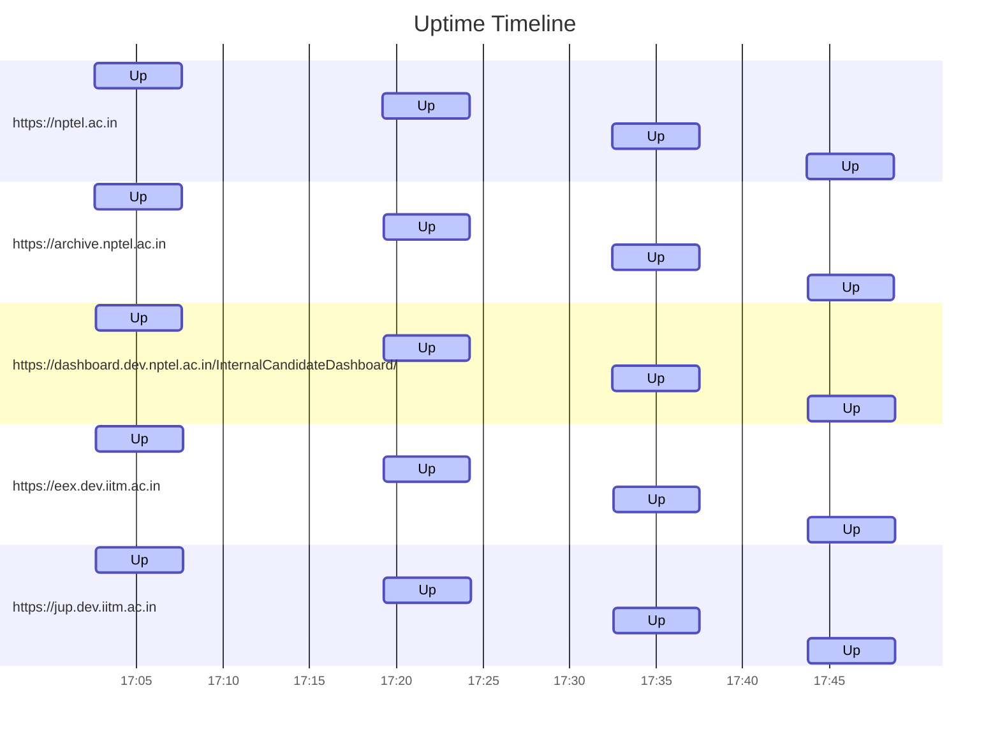

# Uptime Status
Last updated: Fri Sep 13 17:43:43 UTC 2024

✅ https://nptel.ac.in is up (Response time: .287177822s)
✅ https://archive.nptel.ac.in is up (Response time: 1.443690038s)
✅ https://dashboard.dev.nptel.ac.in/InternalCandidateDashboard/ is up (Response time: .950169161s)
✅ https://eex.dev.iitm.ac.in is up (Response time: 1.370831252s)
✅ https://jup.dev.iitm.ac.in is up (Response time: 1.078055877s)

## Summary Statistics (Last 24 hours)
```
Website                                                        Availability  Avg Response Time
https://eex.dev.iitm.ac.in                                     100.00%       1.247s
https://jup.dev.iitm.ac.in                                     100.00%       1.020s
https://dashboard.dev.nptel.ac.in/InternalCandidateDashboard/  100.00%       0.821s
https://archive.nptel.ac.in                                    100.00%       1.288s
https://nptel.ac.in                                            100.00%       0.263s
```

## Uptime Graph (Last 24 hours)

