# Uptime Status
Last updated: Fri Sep 13 21:46:12 UTC 2024

✅ https://nptel.ac.in is up (Response time: .165123925s)
✅ https://archive.nptel.ac.in is up (Response time: 1.392827501s)
✅ https://dashboard.dev.nptel.ac.in/InternalCandidateDashboard/ is up (Response time: .910351901s)
✅ https://eex.dev.iitm.ac.in is up (Response time: 1.518815669s)
✅ https://jup.dev.iitm.ac.in is up (Response time: 1.099825201s)

## Summary Statistics (Last 24 hours)
```
Website                                                        Availability  Avg Response Time
https://eex.dev.iitm.ac.in                                     100.00%       1.306s
https://jup.dev.iitm.ac.in                                     100.00%       1.016s
https://dashboard.dev.nptel.ac.in/InternalCandidateDashboard/  100.00%       0.823s
https://archive.nptel.ac.in                                    100.00%       1.288s
https://nptel.ac.in                                            100.00%       0.294s
```

## Uptime Graph (Last 24 hours)

```mermaid
gantt
    title Uptime Timeline
    dateFormat YYYY-MM-DD HH:mm:ss
    axisFormat %H:%M
    section https://nptel.ac.in
        Up: active, 2024-09-13 17:02:35, 5m
        Up: active, 2024-09-13 17:19:13, 5m
        Up: active, 2024-09-13 17:32:28, 5m
        Up: active, 2024-09-13 17:43:43, 5m
        Up: active, 2024-09-13 17:55:11, 5m
        Up: active, 2024-09-13 18:24:46, 5m
        Up: active, 2024-09-13 18:42:34, 5m
        Up: active, 2024-09-13 18:53:45, 5m
        Up: active, 2024-09-13 19:12:36, 5m
        Up: active, 2024-09-13 19:25:02, 5m
        Up: active, 2024-09-13 19:37:36, 5m
        Up: active, 2024-09-13 19:48:39, 5m
        Up: active, 2024-09-13 19:59:59, 5m
        Up: active, 2024-09-13 20:24:18, 5m
        Up: active, 2024-09-13 20:37:45, 5m
        Up: active, 2024-09-13 20:49:08, 5m
        Up: active, 2024-09-13 21:00:38, 5m
        Up: active, 2024-09-13 21:22:18, 5m
        Up: active, 2024-09-13 21:34:40, 5m
        Up: active, 2024-09-13 21:46:12, 5m
    section https://archive.nptel.ac.in
        Up: active, 2024-09-13 17:02:37, 5m
        Up: active, 2024-09-13 17:19:15, 5m
        Up: active, 2024-09-13 17:32:29, 5m
        Up: active, 2024-09-13 17:43:45, 5m
        Up: active, 2024-09-13 17:55:13, 5m
        Up: active, 2024-09-13 18:24:47, 5m
        Up: active, 2024-09-13 18:42:35, 5m
        Up: active, 2024-09-13 18:53:46, 5m
        Up: active, 2024-09-13 19:12:37, 5m
        Up: active, 2024-09-13 19:25:03, 5m
        Up: active, 2024-09-13 19:37:38, 5m
        Up: active, 2024-09-13 19:48:40, 5m
        Up: active, 2024-09-13 20:00:00, 5m
        Up: active, 2024-09-13 20:24:19, 5m
        Up: active, 2024-09-13 20:37:46, 5m
        Up: active, 2024-09-13 20:49:09, 5m
        Up: active, 2024-09-13 21:00:39, 5m
        Up: active, 2024-09-13 21:22:19, 5m
        Up: active, 2024-09-13 21:34:41, 5m
        Up: active, 2024-09-13 21:46:13, 5m
    section https://dashboard.dev.nptel.ac.in/InternalCandidateDashboard/
        Up: active, 2024-09-13 17:02:38, 5m
        Up: active, 2024-09-13 17:19:15, 5m
        Up: active, 2024-09-13 17:32:30, 5m
        Up: active, 2024-09-13 17:43:46, 5m
        Up: active, 2024-09-13 17:55:13, 5m
        Up: active, 2024-09-13 18:24:48, 5m
        Up: active, 2024-09-13 18:42:36, 5m
        Up: active, 2024-09-13 18:53:47, 5m
        Up: active, 2024-09-13 19:12:38, 5m
        Up: active, 2024-09-13 19:25:04, 5m
        Up: active, 2024-09-13 19:37:38, 5m
        Up: active, 2024-09-13 19:48:41, 5m
        Up: active, 2024-09-13 20:00:01, 5m
        Up: active, 2024-09-13 20:24:20, 5m
        Up: active, 2024-09-13 20:37:47, 5m
        Up: active, 2024-09-13 20:49:10, 5m
        Up: active, 2024-09-13 21:00:40, 5m
        Up: active, 2024-09-13 21:22:20, 5m
        Up: active, 2024-09-13 21:34:42, 5m
        Up: active, 2024-09-13 21:46:14, 5m
    section https://eex.dev.iitm.ac.in
        Up: active, 2024-09-13 17:02:39, 5m
        Up: active, 2024-09-13 17:19:16, 5m
        Up: active, 2024-09-13 17:32:31, 5m
        Up: active, 2024-09-13 17:43:47, 5m
        Up: active, 2024-09-13 17:55:15, 5m
        Up: active, 2024-09-13 18:24:50, 5m
        Up: active, 2024-09-13 18:42:37, 5m
        Up: active, 2024-09-13 18:53:48, 5m
        Up: active, 2024-09-13 19:12:39, 5m
        Up: active, 2024-09-13 19:25:05, 5m
        Up: active, 2024-09-13 19:37:40, 5m
        Up: active, 2024-09-13 19:48:42, 5m
        Up: active, 2024-09-13 20:00:02, 5m
        Up: active, 2024-09-13 20:24:21, 5m
        Up: active, 2024-09-13 20:37:48, 5m
        Up: active, 2024-09-13 20:49:11, 5m
        Up: active, 2024-09-13 21:00:42, 5m
        Up: active, 2024-09-13 21:22:21, 5m
        Up: active, 2024-09-13 21:34:43, 5m
        Up: active, 2024-09-13 21:46:16, 5m
    section https://jup.dev.iitm.ac.in
        Up: active, 2024-09-13 17:02:40, 5m
        Up: active, 2024-09-13 17:19:17, 5m
        Up: active, 2024-09-13 17:32:32, 5m
        Up: active, 2024-09-13 17:43:48, 5m
        Up: active, 2024-09-13 17:55:16, 5m
        Up: active, 2024-09-13 18:24:51, 5m
        Up: active, 2024-09-13 18:42:38, 5m
        Up: active, 2024-09-13 18:53:49, 5m
        Up: active, 2024-09-13 19:12:40, 5m
        Up: active, 2024-09-13 19:25:06, 5m
        Up: active, 2024-09-13 19:37:40, 5m
        Up: active, 2024-09-13 19:48:43, 5m
        Up: active, 2024-09-13 20:00:03, 5m
        Up: active, 2024-09-13 20:24:22, 5m
        Up: active, 2024-09-13 20:37:49, 5m
        Up: active, 2024-09-13 20:49:12, 5m
        Up: active, 2024-09-13 21:00:43, 5m
        Up: active, 2024-09-13 21:22:23, 5m
        Up: active, 2024-09-13 21:34:44, 5m
        Up: active, 2024-09-13 21:46:17, 5m
```

