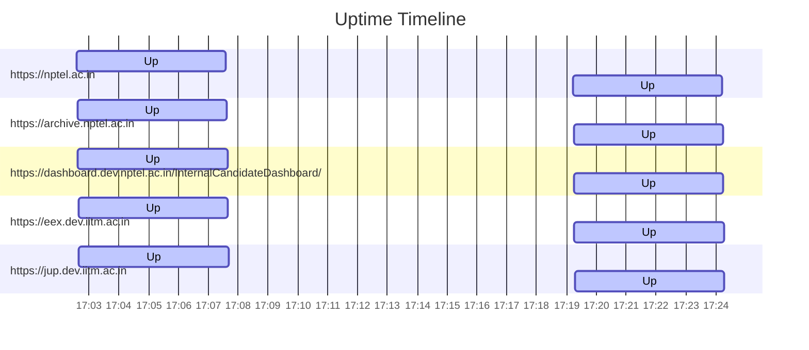

# Uptime Status
Last updated: Fri Sep 13 17:19:13 UTC 2024

✅ https://nptel.ac.in is up (Response time: .126572783s)
✅ https://archive.nptel.ac.in is up (Response time: 1.221777626s)
✅ https://dashboard.dev.nptel.ac.in/InternalCandidateDashboard/ is up (Response time: .739668490s)
✅ https://eex.dev.iitm.ac.in is up (Response time: 1.154019175s)
✅ https://jup.dev.iitm.ac.in is up (Response time: 1.009554794s)

## Summary Statistics (Last 24 hours)
```
Website                                                        Availability  Avg Response Time
https://eex.dev.iitm.ac.in                                     100.00%       1.220s
https://jup.dev.iitm.ac.in                                     100.00%       1.023s
https://dashboard.dev.nptel.ac.in/InternalCandidateDashboard/  100.00%       0.786s
https://archive.nptel.ac.in                                    100.00%       1.316s
https://nptel.ac.in                                            100.00%       0.191s
```

## Uptime Graph (Last 24 hours)

