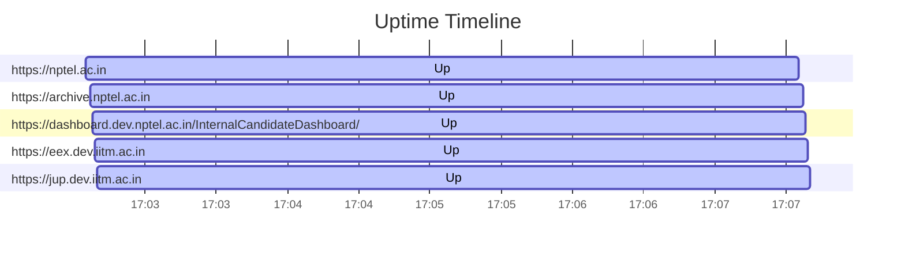

# Uptime Status
Last updated: Fri Sep 13 17:02:35 UTC 2024

✅ https://nptel.ac.in is up (Response time: .256239994s)
✅ https://archive.nptel.ac.in is up (Response time: 1.409227585s)
✅ https://dashboard.dev.nptel.ac.in/InternalCandidateDashboard/ is up (Response time: .833198600s)
✅ https://eex.dev.iitm.ac.in is up (Response time: 1.285093918s)
✅ https://jup.dev.iitm.ac.in is up (Response time: 1.036465339s)

## Summary Statistics (Last 24 hours)
```
Website                                                        Availability  Avg Response Time
https://eex.dev.iitm.ac.in                                     100.00%       1.285s
https://jup.dev.iitm.ac.in                                     100.00%       1.036s
https://dashboard.dev.nptel.ac.in/InternalCandidateDashboard/  100.00%       0.833s
https://archive.nptel.ac.in                                    100.00%       1.409s
https://nptel.ac.in                                            100.00%       0.256s
```

## Uptime Graph (Last 24 hours)

