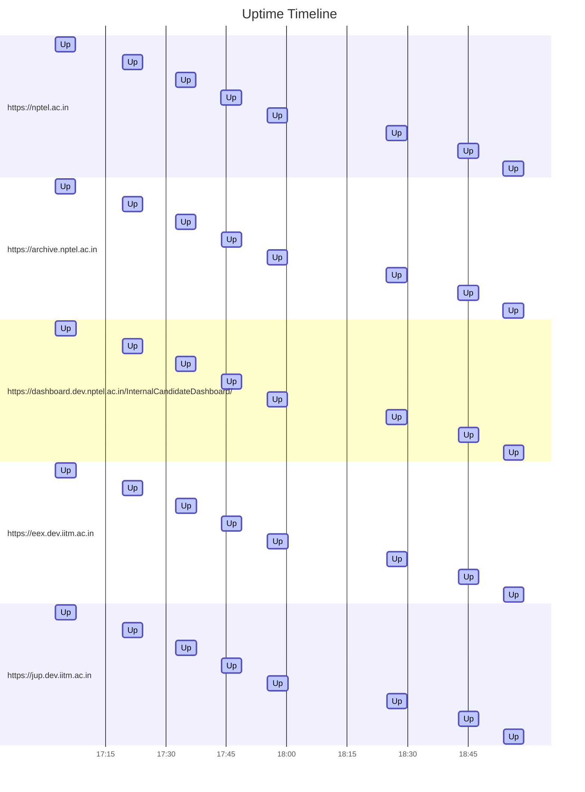

# Uptime Status
Last updated: Fri Sep 13 18:53:44 UTC 2024

✅ https://nptel.ac.in is up (Response time: .309966915s)
✅ https://archive.nptel.ac.in is up (Response time: 1.153815612s)
✅ https://dashboard.dev.nptel.ac.in/InternalCandidateDashboard/ is up (Response time: .720247749s)
✅ https://eex.dev.iitm.ac.in is up (Response time: 1.207868324s)
✅ https://jup.dev.iitm.ac.in is up (Response time: .937253474s)

## Summary Statistics (Last 24 hours)
```
Website                                                        Availability  Avg Response Time
https://eex.dev.iitm.ac.in                                     100.00%       1.281s
https://jup.dev.iitm.ac.in                                     100.00%       1.026s
https://dashboard.dev.nptel.ac.in/InternalCandidateDashboard/  100.00%       0.837s
https://archive.nptel.ac.in                                    100.00%       1.326s
https://nptel.ac.in                                            100.00%       0.271s
```

## Uptime Graph (Last 24 hours)

